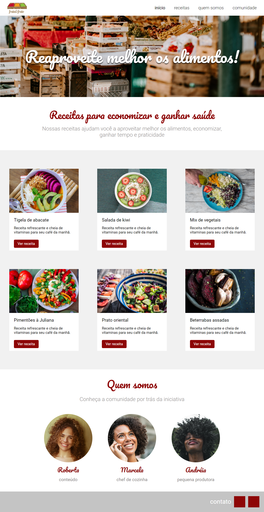

# Página de Receitas Culinárias: Projeto de Desenvolvimento Front-End
Bem-vindo(a) ao meu projeto da Fruta & Fruto! Um projeto de desenvolvimento front-end de uma página de receitas culinárias.

Sou Guilherme Nogueira, estudante de desenvolvimento web na plataforma de ensino online [Alura](https://www.alura.com.br/). Esta é uma das páginas web que desenvolvi praticando front-end com as linguagens HTML e CSS, ao longo do curso de **Arquitetura CSS: descomplicando os problemas** - [certificado de conclusão](https://cursos.alura.com.br/certificate/40db627c-76d3-4d84-9fe7-bf4eab50c80d?lang=pt_BR).

## Sobre o Projeto

Se trata de uma página de receitas culinárias, contendo um **header**, **banner**, **conteúdo principal** [receitas], uma seção **sobre** e um **footer**, completamente responsivos em dispositivos móveis.

## Linguagens Utilizadas

* HTML
* CSS

## Ferramentas Utilizadas

* Visual Studio Code
* Figma

## Detalhes Técnicos

- Utilizei Flexbox para criar layouts flexíveis e responsivos.
- Implementei Media Queries para adaptar a página a diferentes tamanhos de tela.
- Adotei nomenclatura de classes seguindo a metodologia BEM.
- Organizei meus arquivos CSS utilizando a metodologia do Atomic Design, separando os estilos em organismos, moléculas e átomos.
- Utilizei variáveis CSS para facilitar a manutenção, centralizando cores, fontes, tamanhos de fontes e pesos de fontes em um único lugar.

## Como Visualizar

Você pode visualizar a página aqui: 

## Sobre Mim

Sou um entusiasta da tecnologia e estou focado em me tornar um desenvolvedor full-stack. Atualmente, estou concentrado no estudo do front-end, 
onde estou aprimorando minhas habilidades em HTML, CSS e JavaScript. No entanto, meu objetivo é abraçar todas as camadas do desenvolvimento de 
software, incluindo back-end e data science.

## Minhas Linguagens Mais Usadas

## Contato

Se você tiver alguma dúvida, feedback ou interesse em colaborar em algum projeto, ficarei feliz em conversar: 

## Redes Sociais 
Acesse minhas redes:

    
